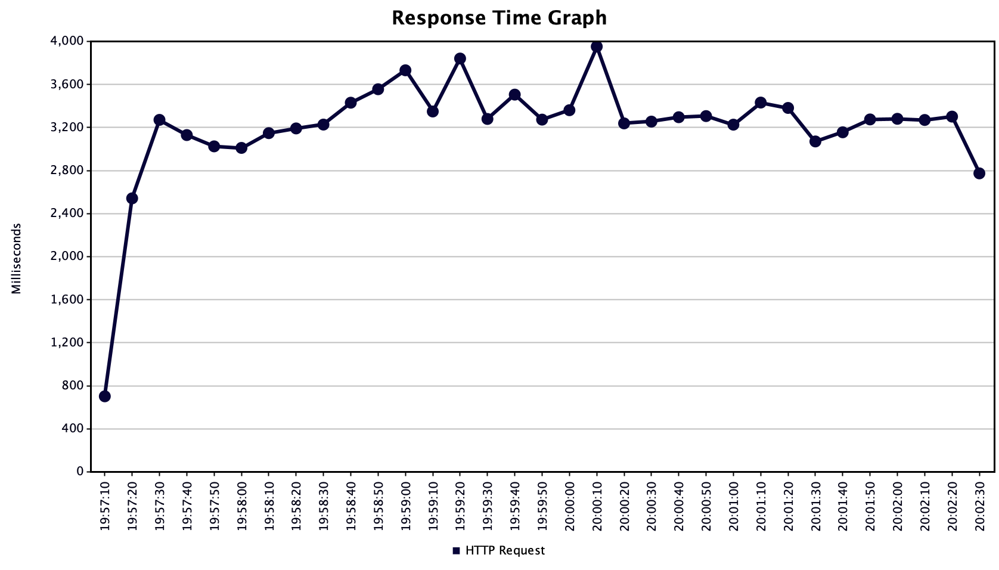

# Описание решения

Процессорное время, затрачиваемое на выполнение данного кода, несоизмеримо мало в сарвнении с IO операциями. Для обеспечения максимального быстродействия следует каждую IO операцию производить асинхронно, а следовательно, в отдельном потоке. 

С другой стороны, ОС ограничивает количество потоков, а также количество открытых соединений. При исчерпании лимита код будет завершаться ошибкой при попытке запуска нового потока или при установке соединения. Максимальный размер пула может быть определен как минимум от двух лимитов и задан в свойствах. (С учетом погрешности на уже запущенные потоки и открытые соединения).
 
В качестве очереди используется очередь с нулевым размером (канал). Которая рекомендована для выполннения краткосрочных асинхронных задач, в которых объект, работающий в одном потоке, должен синхронизироваться с объектом, работающим в другом потоке, чтобы передать ему некоторую информацию.

Размер пула потоков является узким местом, "бутылочным горлышком" и ограничивает производительность системы. Когда нагрузка превышает возможности пула, система выбрасывает `RejectedExecutionException`. Которое перехватывается и обрабатыается в ответ сервера `503 Service Unavailable`.

Недостатком такого решения является отсутствие буфера, который помог бы обработать кратковременные пиковые нагрузки. Но попытки использовать очереди с фиксированным или динамическим размером приводят к кратному снижению производительности. 

## Нагрузочное тестирование

### Стенд (локальная сеть)

* **Сервер поставщик тестовых данных** nginx/1.18.0 (Arch Linux 5.10.6x86_64) Отдает статические json-файлы с выключенным кешированием. В результатах теста видно, что под нагрузкой время ответа находится в пределах от 20ms до 2000ms. Поэтому, искусственные таймауты излишни.

* **Сервер приложения** MacBook Air (macOS Big Sur) с настройками ядра:

```BASH
sudo sysctl -w kern.ipc.somaxconn=4096
sudo sysctl -w net.inet.tcp.msl=100
```
Установлен JMeter (5.4.1) с настройками

```BASH
httpclient4.retrycount=1
hc.parameters.file=hc.parameters
http.connection.stalecheck$Boolean=true
```

* **Нагрузочный стенд** iMac (macOS Big Sur) с аналогичными настройками.

* **Роутер** Keenetic Ultra (KN-1810) WiFi 5G на маках и 2.4G на линуксе, не менее 100Mb.

### Результаты

* Nginx (2000 одновременных потоков)


Среднее время ответа 360 ms. Максимальное количество потоков, запросы которых стенд обработал без ошибок. **Это значение используется как размер пула потоков в приложении**

* Приложение (200 одновременных потоков)


Среднее время ответа 300 ms. Без ошибок.

* Приложение (500 одновременных потоков)


Среднее время ответа 600 ms. Без ошибок.

* Приложение (1000 одновременных потоков)

Среднее время ответа 1000 ms. Без ошибок.

* Приложение (2000 одновременных потоков)



Среднее время ответа 3200 ms. Появились ошибки соединения.
